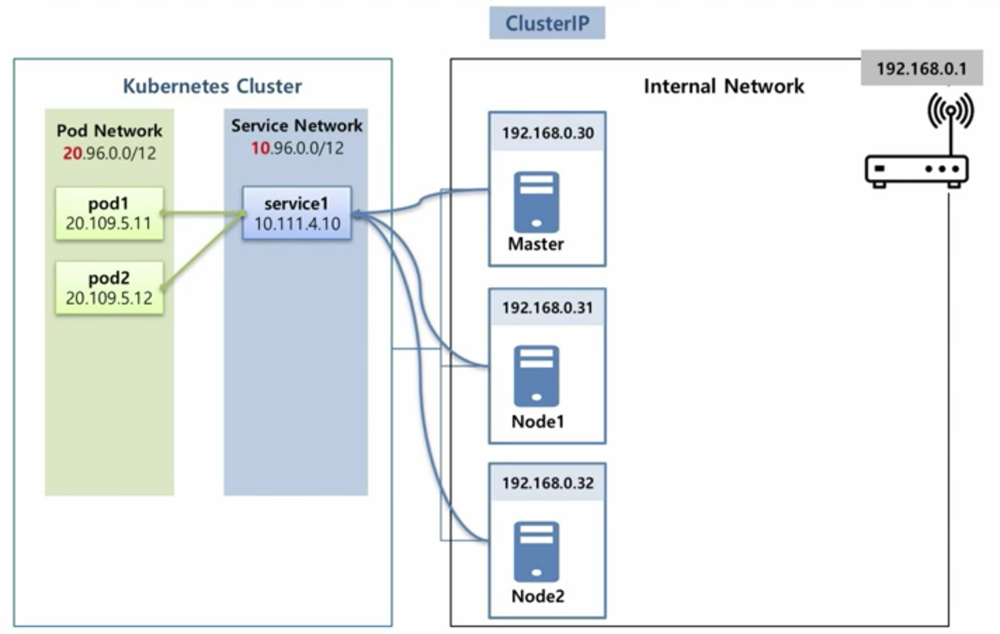
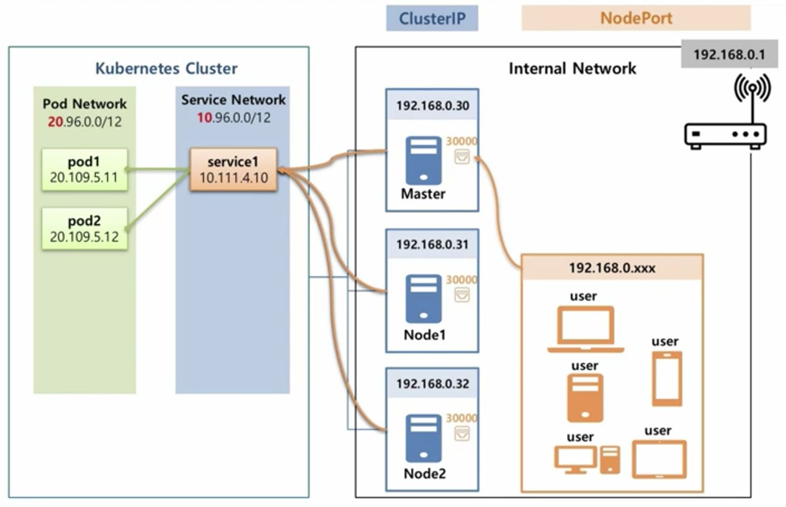
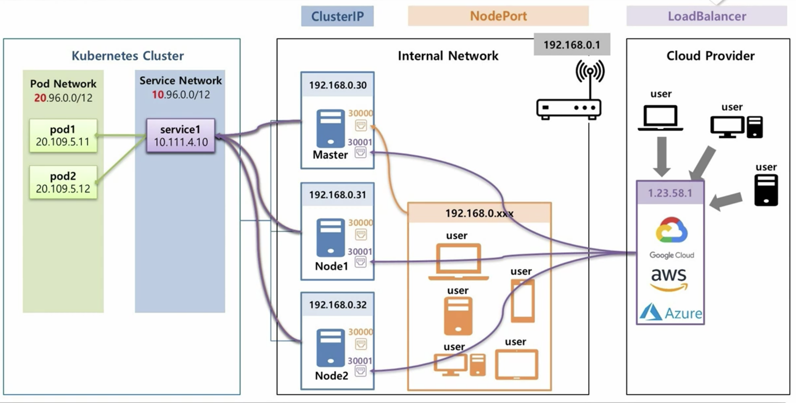

<br>

## 서비스(Service)의 필요성

서비스의 필요성을 알기 위해서는 쿠버네티스의 기본 사상에 대해 알아야 한다. 쿠버네티스는 1개 이상의 컨테이너로 구성된 파드(Pod)로 동작한다.  
쿠버네티스에서 파드란 <u>언제든지 없어지고 생겨날 수 있는 유동적인 존재</u>이다. 배달의민족에서 할인권을 배포하는 이벤트를 진행했다고 가정하자. 갑자기 급증하는 수많은 트래픽을 감당하기 위한 수많은 서버가 이벤트 기간 동안 필요할 것이다. 그리고 그 서버들에는 트래픽을 받아서 처리할 수 있는 어플리케이션이 들어가야 할 것이다. 이러한 어플리케이션은 컨테이너 형태로 배포되고, 추가된 서버에 설치된 각 어플리케이션을 쿠버네티스로 효과적으로 관리하기 위해 컨테이너를 파드로 관리할 것이다.  
여기서 파드는 '할인권 배포 이벤트 기간'이 지나면 자연스럽게 소멸될 것이다. 이렇듯 파드는 특정 업무에 따라 손쉽게 생겨나기도 없어지기도 한다. 문제는 이러한 파드의 유동성만큼 파드의 접근성도 유동적이게 된다면 쿠버네티스를 이용한 관리가 꽤나 복잡해질 것이다. 새로운 파드가 생겨날때마다 일일이 파드에 접근하는 경로를 수정해야 한다면 얼마나 버거울지 상상만해도 끔찍하다.  
쿠버네티스에서는 이러한 불편함을 해소하기 위해 '서비스(Service)'라는 오브젝트를 사용한다. 서비스라는 별도의 오브젝트가 쿠버네티스 안에서 운영되며, <u>설정된 라벨에 해당하는 파드에 언제든지 접근할 수 있도록 한다.</u> 이러한 서비스 방식에는 총 3가지가 존재한다.

<br>

다음과 같은 파드를 3가지 서비스를 이용하여 각각 연결해본다고 가정하자. 파드의 labels 값을 보고 서비스가 연결된다는 것을 기억하자.

```yaml
apiVersion: v1
kind: Pod
metadata:
  name: pod
  labels:
     app: sample
spec:
  containers:
    ... # 생략
    ports:
    - containerPort: 8080
```

## ClusterIP

> 범위: 내부망 안에 있는 쿠버네티스 클러스터에서만 가능!

<!--   
*@그림 1: ClusterIP 예시 그림* -->

  
*@그림 1: ClusterIP 예시 그림 - 출처: 강의자료*

ClusterIP는 <u>'쿠버네티스 클러스터로 구성된 노드 내에서만 해당 파드로 접근'</u>할 수 있도록 하는 서비스다. 위의 그림과 같이 서비스는 Master노드와 두개의 Worker노드에서만 Pod1과 Pod2에 접근할 수 있도록 한다. <u>기본적으로 파드는 20번대, 서비스는 10번대의 IP를 생성과정에 자동으로 부여</u>한다.  
ClusterIP는 서버에 접근할 수 있는 권한이 있는, 내부관리자만 접근이 가능한 파드를 구성하고자 할 때 사용한다. 같은 내부망이라도 해도 쿠버네티스 클러스터에 접근하지 못한다면 서비스를 이용하여 파드로 접근할 수 없다. 

```yaml
apiVersion: v1
kind: Service
metadata:
  name: svc-1
spec:
  selector:
    app: sample
  ports:
  - port: 9000
    targetPort: 8080
  #type: ClusterIP
```

위의 예시는 서비스에 할당된 IP의 9000번 포트로 들어가면 sample이라는 selector를 갖는 파드의 8080 포트로 연결해준다.  
spec/type에 ClusterIP, NodePort, LoadBalancer 중 하나를 명시하는데, 이를 생략하면 자동으로 ClusterIP로 만들어진다.

> curl 10.x.y.z:9000/api

<br>

## NodePort

> 범위: 내부망 안에만 있으면 가능!

<!--    -->
  
*@그림 2: NodePort 예시 그림 - 출처: 강의자료*

NodePort는 ClusterIP에서 더 나아가 <u>내부망 안에만 있다면 서비스 호출이 가능</u>하도록 하는 서비스이다. NodePort는 30000 ~ 32767번 사이의 포트를 제공하는데, 사용자는 해당 포트를 이용하여 파드에 접근할 수 있다. 주로 내부망에서 개발된 내용을 검증하거나 시연하는 용도로 사용된다. 

```yaml
apiVersion: v1
kind: Service
metadata:
  name: svc-2
spec:
  selector:
    app: sample
  ports:
  - port: 9000
    targetPort: 8080
    nodePort: 30000 # 할당하지 않으면 30000~32767 중 무작위로 포트가 생성됨
  type: NodePort
  externalTrafficPolicy: Local #Local, Cluster 중 택일
```

위의 예시를 다시한번 정리하면 다음과 같다.
1. 내부망에서 30000번 포트로 진입
2. ClutserIP 서비스 포트 9000번을 통해 쿠버네티스 클러스터로 진입
3. 클러스터가 sample selector를 갖는 파드의 8080번 포트로 연결

externalTrafficPolicy는 Local과 Cluster 각각에 따라 다음과 같이 구성된다.
- Local : 서비스를 띄운 노드에 있는 파드로만 접근 가능
- Cluster : 서비스를 띄운 노드에 있는 파드 외에도 다른 노드의 파드에도 접근 가능

  
*@그림 3: NodePort에서 externalTrafficPolicy 예시 - 출처: 김태민(KUBETM) 블로그*

위의 예시 그림을 보면 Node1과 Node2가 있다. Node1에서 NodePort 서비스를 띄웠을 때, externalTrafficPolicy가 Local이면 Node1에 있는 파드에만 접근할 수 있고, Cluster로 하면 Node2에 있는 파드 또한 접근할 수 있게 된다.

<br>

## LoadBalancer

> 범위: 외부망에서도 가능!

<!--    -->
  
*@그림 4: LoadBalancer 예시 그림 - 출처: 강의자료*

클라우드 서비스와 같이 <u>외부망에서 내부로 접근</u>하는 경우에 사용된다. 그림과 같이 LoadBalancer 타입의 서버를 외부망에, NodePort를 내부망에 구성하여 외부망에 있는 사용자가 LoadBalancer를 통해 내부망의 NodePort에 접근하고 이후 NodePort를 통해 파드로 접근할 수 있도록 구성한다. LoadBalancer는 클라우드 서비스 제공자를 통해서만 IP를 생성할 수 있으며, 사용자는 해당 IP를 통해서 내부망에 있는 쿠버네티스 클러스터에 접근할 수 있다. 

```yaml
apiVersion: v1
kind: Service
metadata:
  name: svc-3
spec:
  selector:
    app: sample
  ports:
  - port: 9000
    targetPort: 8080
  type: LoadBalancer
```

<br>

## Pod의 입장에서 바라보기

결국 서비스의 목적은 클러스터, 내부망 혹은 외부의 클라우드망에서 원하는 파드로 연결하기 위함에 있다. 이제는 파드의 입장에서 원하는 서비스에 연결하거나 혹은 직접 원하는 파드에 연결할 수 있는 방법, 혹은 외부 서비스에 안정적으로 연결할 수 있는 방법에 대해서 알아본다.  

<br>

### Headless

  
*@그림 5: Headless 예시 그림 - 출처: 강의자료*

일반적으로 쿠버네티스 클러스터 내에서 파드와 서비스는 동시에 배포되는 경우가 많다. 즉, 배포되는 시점에 동적으로 파드 혹은 서비스에 IP가 할당되기 때문에 미리 해당 오브젝트의 IP를 알 수 있는 방법이 없다. 또한 파드의 경우 삭제와 생성이 빈번하게 발생할 수 있기 때문에, 혹여나 미리 IP를 알아냈다 하더라도 운영환경에서 이를 지속적으로 유지할 수 없을 것이다. 이러한 환경에서 <u>파드가 서비스를 경유하지 않고 서로 다른 파드와 직접 연결하고자 할 때, Headless를 사용한다.</u>

> 이를 기존의 방식과 비교하면 다음과 같다. Pod1이 Pod2와 연결하고자 할 때,
> 1. 기존 서비스 이용 방식
> - Pod1이 서비스의 위치(IP)를 DNS Server를 통해 획득
> - 해당 IP로 접근
> - Pod2와 연결
> 2. Headless 사용 시
> - DNS Serverdp Pod의 이름과 서비스 이름을 연결한 이름을 갖는 내용이 작성됨 (Pod2.Service)
> - 해당 이름으로 Pod2에 접근

  
*@그림 6: 서비스를 이용한 파드 연결 구조 샘플 - 출처: 강의자료*

파드와 서비스 모두 클러스터 내부에 생성이 cluster.local이라는 이름의 DNS에 해당 내용이 저장된다. 위의 그림에서 서비스의 경우 <u>서비스명.네임스페이스명.오브젝트타입.DNS명</u>으로 이름이 생성되는 것을 볼 수 있다. 이렇게 생성되는 구조를 FQDN(Fully Qulified Domian Name)이라고 부른다.  
단 서비스의 경우 같은 네임스페이스 안에서 맨 앞의 서비스 이름만 가지고도 식별이 가능하지만, 파드의 경우에는 전체 이름을 모두 적어야만 파드 간 구별이 가능하다. 

> 간단한 예시로, 파드의 경우에는 별도의 이름을 가지고 만들어지지 않기도 하지만 동시에 하나의 노드에 여러개의 파드가 생성되기 때문에 단일 이름으로는 절대 구별할 수 없게 된다.

```yaml
apiVersion: v1
kind: Service
metadata:
  name: headless-service
spec:
  selector:
    svc: headless-1
  ports:
    - port: 80
      targetPort: 8080    
  clusterIP: None   # 이렇게 작성해야 Headless 서비스가 만들어진다.
```

```yaml
apiVersion: v1
kind: Pod
metadata:
  name: headless-pod
  labels:
    svc: headless
spec:
  hostname: pod-1  # 도메인 이름을 넣어준다.
  subdomain: headless # Headless 형태로 생성된 서비스 이름을 넣어준다.
  containers:
  - name: nginx
    image: nginx
```

  
*@그림 7: Headless를 이용한 파드 연결 구조 샘플 - 출처: 강의자료*

서비스에 IP가 없는(ClusterIP : None) 구조이기 때문에, DNS를 호출하면 서비스에 연결된 모든 파드의 정보들을 반환하게 된다. DNS 내부에 저장되어 있는 서비스와 파드 각각의 정보는 위의 그림과 같다. 파드의 경우 <u>파드이름.헤드리스서비스이름</u>으로 구분되고 이하는 서비스와 동일하게 구성되므로, 파드를 호출하고자 한다면 해당 이름을 사용하면 된다.

```sh
$ curl pod-1.headless-1:8080/
```

<br>

### Endpoint

  
*@그림 8: Endpoint 구조 - 출처: 강의자료*


서비스가 파드와 연결하려면 라벨(label)을 사용해야 한다. 쿠버네티스 내에서는 이러한 라벨 관계를 Endpoint를 가지고 관리한다.  
서비스가 만들어지면 서비스 이름과 동일한 이름의 Endpoint가 만들어지고, 이러한 Endpoint 내에는 파드로 연결하는 접속 정보가 생성된다. 이 말은 서비스 생성 과정에 라벨을 만들지 않더라도, 향후 Endpoint를 통해 직접 파드와 서비스를 연결할 수 있다.

<br>

### ExternalName

Google, Github과 같은 외부 사이트로 연결되는 서비스가 있다고 가정하자. 이러한 도메인은 서버의 상태에 따라 지속적으로 IP가 변경될 수 있으므로, IP를 기준으로 해당 사이트에 연결한다는 것은 불가능한 일이다. 이러한 동적인 IP를 갖는 외부 도메인에 연결하는 서비스에는 ExternalName을 사용하여 문제 없이 IP를 동적으로 연결할 수 있다.

<br>

## 참고자료
- [대세는 쿠버네티스 [초급~중급] - 김태민](https://www.inflearn.com/course/쿠버네티스-기초/dashboard)